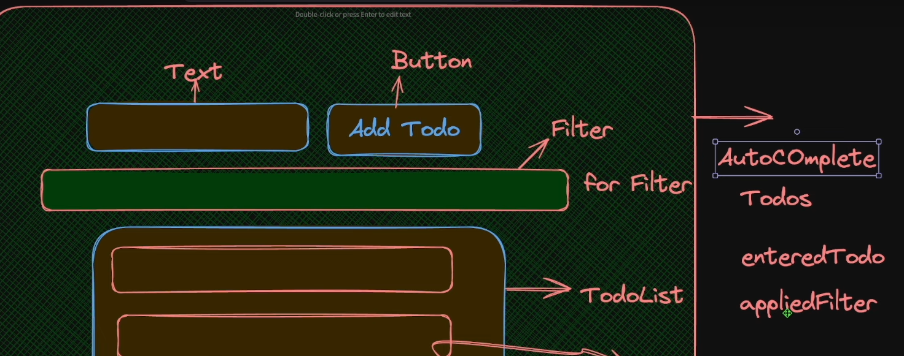

# Todo Application Design and Concepts

This document outlines the design principles and best practices followed in the implementation of a Todo application built using React.

---

## Why Have an `App.js` Parent Component?

-   The `App.js` component acts as a parent to hold all child components.
-   It facilitates communication among sibling components. If data/state resided only in child components, sharing it across siblings would be challenging.
-   Deciding the parent component is a critical design step to maintain an effective data flow.


---

## Determining Parent Component State

-   Identify which data should be managed in the parent component.
-   Example: Managing all todos, the input field value, and filter information at the parent level.



---

## Key Features and Concepts

### Prop Validation and Default Props

-   Props are validated and assigned default values (e.g., for buttons) to ensure robustness and avoid unexpected errors.

### Input Field Component Abstraction

-   The `InputText` component bubbles up changes to the parent using `onChange` callbacks.
-   By abstracting logic (like extracting `e.target.value`), repetitive code is avoided. For example:
    -   Instead of writing `e.target.value` extraction logic 10 times, it's handled once within the component.
    -   This improves reusability and reduces redundancy.

### `window.todoId` for Unique Keys

-   A global `todoId` variable is used to generate unique IDs for each todo item dynamically.

### Deep Copying with `structuredClone`

-   Used for creating deep copies of objects to avoid mutation of existing state.

---

## Additional Insights

### Function References vs Function Calls

-   Avoid passing function calls directly to event handlers to prevent unexpected behavior.
    [Learn more here](https://geekymuch.hashnode.dev/understanding-function-call-vs-function-reference-in-react-a-deep-dive).

### Using `index` from `.map`

-   Utilize the index provided by `.map` in render logic, reducing the need to iterate over todos again in event handlers.

### State Staleness in React

-   **The Problem**: React state updates are asynchronous. Working with state immediately after updating may lead to using outdated data.
-   **The Solution**: Always retrieve the most recent data (e.g., from localStorage) before making updates to ensure the latest information is used.

---

## Optimized State Initialization

-   Instead of using `useEffect`, initialize state with a function:

    ```javascript
    function loadInit() {
    	const todoStrings = localStorage.getItem(TODO_KEY);
    	return JSON.parse(todoStrings ?? "[]");
    }
    const [todos, setTodos] = useState(loadInit);
    ```

-   Why do we have an APP.js parent which holds all the child components?

            -   Because we want the communication to be faciliated among siblings and if all the data/state are with the child component it would be difficult to send it to parent and share among siblings - so deciding whos the parent comp is a big step

        

        -   Next big step would be to determine what data must be kept within the parent

        

            -   All todos, input todo, filter info

        -   Prop validation and default props for button component
        -   InputField bubbles up the change to the parent by using function (like onChange) value and onchange as props because the parent needs to maintain state

        -   handleChange of the input comp, inside which I extract the value from the event object and passed it to the onChange callback so that any component usnig the inputText component that doesnt have to do the same again and again (ex-> If I use this input component 10 times in different places then I would have to 10 times write e.target.value) COMPONENT ABSTRACTION to reduce repetitive code and improve reusability.
            Any parent component using InputText doesn't need to repeat the e.target.value extraction logic every time it uses this input.

        -   window.todoId for keying the todos

        -   structuredclone for deep copying

        -   [function references versus function calls](https://geekymuch.hashnode.dev/understanding-function-call-vs-function-reference-in-react-a-deep-dive)

        -   https://x.com/PranjalUncodes/status/1865736977544315366

        -   using index from map instead (in the render component) of again and again iterating in the handler functions in the parent

        -   a potential issue with relying on state to retrieve todos during rendering, especially when new todos are expected to be fetched or updated

        - State Staleness in React (Due to async nature of state updates)

    React state updates are not instant. When you call setTodos(), React doesn't immediately update the state, which can lead to working with outdated data.
    The Problem
    Relying on the current state value right after updating can result in using stale (old) information, especially during rapid updates or asynchronous operations.
    The Solution
    Always retrieve the most recent data directly from the primary source (like localStorage) before making updates, ensuring you're working with the latest information.

    -   using a function as a state variable to load initially the localstorage instead of a straight useEffect

    -   grouping together of done and pending
